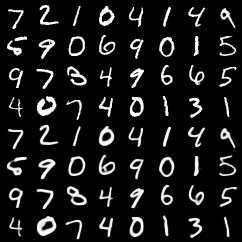
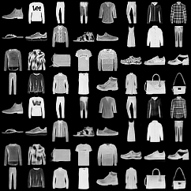
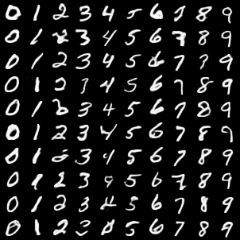
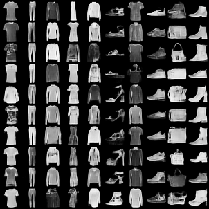

## Reproducing Neural Discrete Representation Learning
### Course Project for [IFT 6135 - Representation Learning](https://ift6135h18.wordpress.com/)

Project Report link: [final_project.pdf](final_project.pdf)

### Instructions
1. To train the VQVAE with default arguments as discussed in the report, execute:
```
python vqvae.py --data-folder /tmp/miniimagenet --output-folder models/vqvae
```
2. To train the PixelCNN prior on the latents, execute:
```
python pixelcnn_prior.py --data-folder /tmp/miniimagenet --model models/vqvae --output-folder models/pixelcnn_prior
```

### Reconstructions from VQ-VAE
Top 4 rows are Original Images. Bottom 4 rows are Reconstructions.
#### MNIST

#### Fashion MNIST


### Class-conditional samples from VQVAE with PixelCNN prior on the latents
#### MNIST

#### Fashion MNIST


### Comments
1. We noticed that implementing our own VectorQuantization PyTorch function speeded-up training of VQ-VAE by nearly 3x. The slower, but simpler code is in this [commit](https://github.com/ritheshkumar95/pytorch-vqvae/tree/cde142670f701e783f29e9c815f390fc502532e8).
2. We added some basic tests for the vector quantization functions (based on `pytest`). To run these tests
```
py.test . -vv
```

### Authors
1. Rithesh Kumar
2. Tristan Deleu
3. Evan Racah
